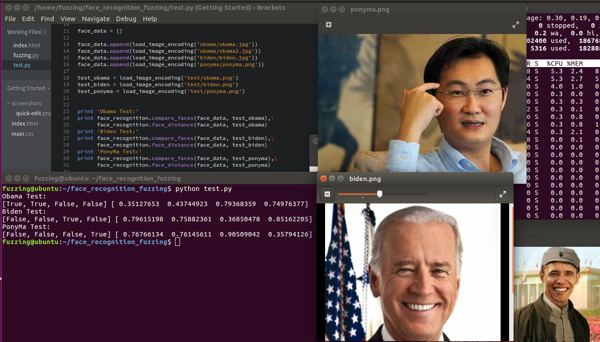
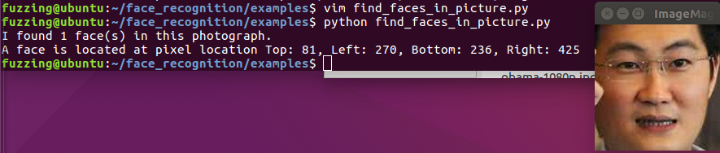

## face_recognition_fuzzing

### 人脸识别

  上周末在T00ls 沙龙听议题,最后的议题里提到人脸识别的绕过思路来了兴致,加上最近也在研究机器学习相关的知识,觉得很有意思

  在机器学习的算法里,无论是做预测还是分类,都离不开**概率**.人脸识别是机器学习里的分类,识别出来的结果是根据此前学习到的所有人脸数据的检测概率来判断,下面是人脸识别测试,测试数据使用奥巴马,拜登和马化腾三人的照片



  在这里可以看到,奥巴马的人脸识别,可以准确识别到前两个学习样本,评分为0.35127653 和0.43744923 ;拜登的人脸识别也与学习样本相匹配(第三个学习样本),评分为0.36850478 ;最后一位是马化腾,人脸识别评分为0.35794126 .注意,在这里数值越低代表相似度越高
  
  这些评分意义在于分析人脸的相似度,我们先看一下face_recognition 的代码实现

```python

    def compare_faces(known_face_encodings, face_encoding_to_check, tolerance=0.6):
        """
        Compare a list of face encodings against a candidate encoding to see if they match.

        :param known_face_encodings: A list of known face encodings
        :param face_encoding_to_check: A single face encoding to compare against the list
        :param tolerance: How much distance between faces to consider it a match. Lower is more strict. 0.6 is typical best performance.
        :return: A list of True/False values indicating which known_face_encodings match the face encoding to check
        """
        return list(face_distance(known_face_encodings, face_encoding_to_check) <= tolerance)

```

  compare_faces() 函数根据face_distance() 函数对比两张图片的相似度做对比,当相似度小于默认值0.6 时,即判断为同一个人


### How to Fuzzing

  让两张不是同一个人的识别成为同一个人,本质上是干扰人脸识别算法的判断概率.引用PPT 的原话:"只需要对每一个像素点做极小的修改,就能影响数据点被分类的结果.必定存在一个与原本数据相差极小而被判断为任意一个类别的数据".简单地来说,通过在脸部附近随机生成一些像素点,会影响到最终识别结果.对原议题Slide 有兴趣的话可以点这里[PPT 链接](http://mp.weixin.qq.com/s/pi9DdgxSUREQSBYS9EBwIA)
  
  我们先使用face_recognition 识别出人脸位置,Demo 代码如下:
  
```python

    from PIL import Image
    import face_recognition

    image = face_recognition.load_image_file("ponyma.png")  #  这里需要根据图片位置改一下路径

    face_locations = face_recognition.face_locations(image)

    print("I found {} face(s) in this photograph.".format(len(face_locations)))

    for face_location in face_locations:
        top, right, bottom, left = face_location
        print("A face is located at pixel location Top: {}, Left: {}, Bottom: {}, Right: {}".format(top, left, bottom, right))

        face_image = image[top:bottom, left:right]
        pil_image = Image.fromarray(face_image)
        pil_image.show()

```
  
  运行这个Demo ,结果如下:
  
  
  
  我们着重对人脸区域进行像素测试,把上面的接口拿过来Fuzzing ,构造区域
  
```python

    face_location = get_face_location(fuzzing_image_path)  #  获取人脸位置
    random_fuzzing_location_top = face_location[0]
    random_fuzzing_location_bottom = face_location[2]
    random_fuzzing_location_left = face_location[3]
    random_fuzzing_location_right = face_location[1]
    
    random_pixel_data = (random.randint(0,255),  #  生成一个随机色素的点
                         random.randint(0,255),
                         random.randint(0,255))
    random_location = (random.randint(random_fuzzing_location_left,random_fuzzing_location_right),  #  生成一个随机位置
                       random.randint(random_fuzzing_location_top,random_fuzzing_location_bottom))
        
```
  
  然后针对这个特定的区域进行画点,假设随机生成的点可以使人脸匹配算法的相似度得到提升,就把它记录下来;如果没有提升,就撤回到原来的像素
  
```python

    last_pixel_data = image.getpixel(random_location)  #  对原来图像上的这个点的色素进行备份

    draw.point(random_location,random_pixel_data)

    fuzzing_face_image = image.convert('RGB')  #  这几行是看源码提取出核心逻辑写的,提高执行效率,如果不这样做的话,就需要PIL 保存fuzzing
    fuzzing_face_array = array(fuzzing_face_image)  #  图片然后再用face_recognition 库加载,效率很低
    fuzzing_face_data = face_recognition.face_encodings(fuzzing_face_array)[0]
    compare_rate = face_recognition.face_distance([source_face_data],fuzzing_face_data)  #  对比人脸识别相似度

    print 'Compare Rate =',compare_rate,' Random Location =',random_location,' Random Pixel Data =',random_pixel_data

    if compare_rate < last_best_compare_rate :  #  判断Fuzzing 生成的像素点有没有让相似度得到提升,一步一步向目标逼近
        last_best_compare_rate = compare_rate

        print 'New Study Rate:' ,last_best_compare_rate
        
```
  
  Fuzzing 过程(gif 有些大,加载需要些时间):
  
  
  
  
  
  
  
  最后出来的结果:
  
  

  Obama Test : 奥巴马与奥巴马的图像识别结果,评分:0.3457349  `obama\obama.jpg`和`obama\obama2.jpg`
  
  Ponyma Test : 奥巴马与马化腾的图像识别结果,评分:0.7926859  `obama\obama.jpg`和`ponyma\ponyma.png`
  
  Ponyma Bypass Test : 奥巴马与带特效的马化腾图像识别结果,评分:0.54513165  `obama\obama.jpg`和`ponyma\ponyma.png_bypass_check.jpg`
  
  完整代码在我的Github:[face_recognition_fuzzing](https://github.com/lcatro/Machine-Learning-Note/tree/master/face_recognition_fuzzing)

