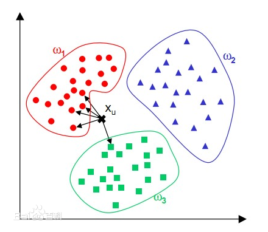

### Machine Learning Note

  机器学习笔记,后续整理一些Python 库使用方法与代码


### 学习资源

[机器学习算法原理](https://github.com/wepe/MachineLearning)<br/>

[机器学习实战原书内容与批注](https://github.com/apachecn/MachineLearning)<br/>

[机器学习的Python 实现](https://github.com/lawlite19/MachineLearning_Python#1-%E4%BB%A3%E4%BB%B7%E5%87%BD%E6%95%B0)<br/>

[机器学习算法集锦](https://zhuanlan.zhihu.com/p/25327755)<br/>

[各种机器学习的应用场景分别是什么](https://www.zhihu.com/question/26726794)<br/>

#### kNN k-邻近算法

```
优点:精度高,对异常值不敏感,无数据输入假定
缺点:计算复杂度高,空间复杂度高
适用数据范围:数值型和标称型

什么是数值型和标称型
标称型:标称型目标变量的结果只在有限目标集中取值
数值型:数值型目标变量则可以从无限的数值集合中取值
```

<br/>

#### 决策树

```
优点:计算复杂度不高,输出结果易于理解,对中间值的缺失不敏感,可以处理不相关特征数据
缺点:可能会产生过度匹配问题
适用数据类型:数值型和标称型
```

#### 朴素贝叶斯

```
优点: 在数据较少的情况下仍然有效,可以处理多类别问题
缺点: 对于输入数据的准备方式较为敏感
适用数据类型: 标称型数据
```

[机器学习算法之朴素贝叶斯(Naive Bayes)--第一篇](http://blog.csdn.net/xlinsist/article/details/51236454)<br/>

[朴素贝叶斯理论推导与三种常见模型](http://blog.csdn.net/u012162613/article/details/48323777)<br/>

[用朴素贝叶斯进行文本分类](http://blog.csdn.net/longxinchen_ml/article/details/50597149)<br/>

[朴素贝叶斯算法之文本分类算法的理解与实现](http://www.cnblogs.com/XBWer/archive/2014/07/13/3840736.html)<br/>

#### logics 回归

```
优点: 计算代价不高,易于理解和实现
缺点: 容易欠拟合,分类精度可能不高
适用数据类型: 数值型和标称型数据
```

[logics 回归总结](http://blog.chinaunix.net/xmlrpc.php?r=blog/article&uid=9162199&id=4223505)<br/>

[logics 回归数学推导](http://sbp810050504.blog.51cto.com/2799422/1608064/)<br/>

#### SVM 支持向量机

```
优点:泛化(由具体的,个别的扩大为一般的,就是说:模型训练完后的新样本)错误率低,计算开销不大,结果易理解
缺点:对参数调节和核函数的选择敏感,原始分类器不加修改仅适合于处理二分类问题
适用数据类型:数值型和标称型数据
```

[SVM 原理](http://www.cnblogs.com/steven-yang/p/5658362.html)<br/>

[通俗易懂SVM](https://www.zhihu.com/question/21094489)<br/>

[SVM和logistic回归分别在什么情况下使用](https://www.zhihu.com/question/21704547)<br/>

#### 深度学习

[零基础入门深度学习(总计六章)](https://zhuanlan.zhihu.com/p/25628246)<br/>

#### CNN

[Deep Learning(深度学习)学习笔记整理系列](http://www.cnblogs.com/zhizhan/p/4077947.html)<br/>

[CNN(卷积神经网络),RNN(循环神经网络),DNN(深度神经网络)的内部网络结构有什么区别](https://www.zhihu.com/question/34681168)<br/>

[一文读懂卷积神经网络CNN](https://www.cnblogs.com/nsnow/p/4562308.html)<br/>

[深度学习简介(一)——卷积神经网络](https://www.cnblogs.com/alexcai/p/5506806.html)<br/>

[卷积神经网络CNN基本概念笔记](http://www.jianshu.com/p/606a33ba04ff)<br/>

[使用Keras+卷积神经网络玩小鸟](http://www.jianshu.com/p/3ba69493f020)<br/>

### Python 库

[scikit-learn 机器学习库](https://github.com/scikit-learn/scikit-learn) ,[scikit-learn 机器学习库中文文档](http://sklearn.apachecn.org/cn/0.19.0/index.html) ,如果无法使用Github 安装sk-learn ,请到Python 官方下载msi 安装文件[scikit-learn 下载传送门](https://pypi.python.org/pypi/scikit-learn)<br/>

[Keras 深度学习库](https://github.com/fchollet/keras)<br/>

[tensorflow 机器学习与深度学习库](https://github.com/tensorflow/tensorflow)<br/>

[matplotlib 数据分析库](https://github.com/matplotlib/matplotlib) ,[matplotlib API 使用手册](http://matplotlib.org/api/index.html)<br/>


